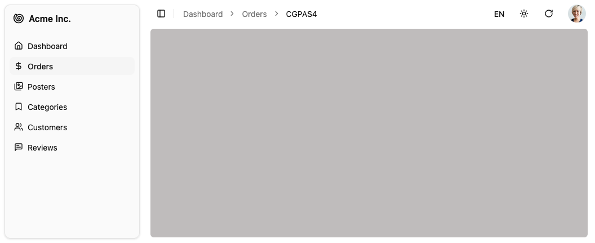

Application shell including sidebar, header (breadcrumb portal, locale & theme toggles, refresh, user menu) and notification area.



## Usage

`<Layout>` wraps the main content of the page. It includes:

- The [AppSidebar](./app-sidebar) component for navigation
- A header with a [breadcrumb](./breadcrumb) portal, [locale](./locales-menu-button) and [theme](./theme-mode-toggle) toggles, [refresh button](./refresh-button), and [user menu](./user-menu)
- An error boundary for error handling (renders the [`<Error>`](./error) component by default)
- A Suspense boundary for loading states (renders the [`<Loading>`](./loading) component by default)
- A notification area for displaying toasts

To customize all these elements, edit the `@/components/admin/layout.tsx` file.

Here is a short version of the default layout component.

```tsx title="@/components/admin/layout.tsx"
import { Suspense, useState, type ErrorInfo, type ReactNode } from "react";
import { cn } from "@/lib/utils";
import { ErrorBoundary } from "react-error-boundary";
import { SidebarProvider, SidebarTrigger } from "@/components/ui/sidebar";
import { UserMenu } from "@/components/admin/user-menu";
import { ThemeModeToggle } from "@/components/admin/theme-mode-toggle";
import { Notification } from "@/components/admin/notification";
import { AppSidebar } from "@/components/admin/app-sidebar";
import { RefreshButton } from "@/components/admin/refresh-button";
import { LocalesMenuButton } from "@/components/admin/locales-menu-button";
import { Error } from "@/components/admin/error";
import { Loading } from "@/components/admin/loading";

export const Layout = (props: { children: ReactNode }) => {
  const [errorInfo, setErrorInfo] = useState<ErrorInfo | undefined>(undefined);
  const handleError = (_: Error, info: ErrorInfo) => {
    setErrorInfo(info);
  };
  return (
    <SidebarProvider>
      <AppSidebar />
      <main className={/* ... */}>
        <header className="flex h-16 md:h-12 shrink-0 items-center gap-2 px-4">
          <SidebarTrigger className="scale-125 sm:scale-100" />
          <div className="flex-1 flex items-center" id="breadcrumb" />
          <LocalesMenuButton />
          <ThemeModeToggle />
          <RefreshButton />
          <UserMenu />
        </header>
        <ErrorBoundary
          onError={handleError}
          fallbackRender={({ error, resetErrorBoundary }) => (
            <Error
              error={error}
              errorInfo={errorInfo}
              resetErrorBoundary={resetErrorBoundary}
            />
          )}
        >
          <Suspense fallback={<Loading />}>
            <div className="flex flex-1 flex-col px-4 ">{props.children}</div>
          </Suspense>
        </ErrorBoundary>
      </main>
      <Notification />
    </SidebarProvider>
  );
};
```

## Props

| Prop      | Required | Type                           | Default          | Description                                             |
| --------- | -------- | ------------------------------ | ---------------- | ------------------------------------------------------- |
| `appBar`  | Optional | `ComponentType<AppBarProps>`   | `<AppBar />`     | Replace the header component rendered above the content |
| `error`   | Optional | `ComponentType<ErrorProps>`    | `<Error />`      | Replace the error-boundary fallback component           |
| `menu`    | Optional | `ComponentType<MenuProps>`     | `<Menu />`       | Replace the menu component rendered inside the sidebar  |
| `sidebar` | Optional | `ComponentType<{ children? }>` | `<AppSidebar />` | Replace the entire sidebar component                    |

When rendering the `<Layout>` component, Shadcn Admin Kit passes it a single prop, `children`, which is the main content of the page (the current resource view, depending on the current route).

## `appBar`

Pass a custom component to replace the default [`<AppBar />`](./app-bar). The replacement receives the same `AppBarProps` interface, so you can wrap the default `<AppBar>` or build a fully custom header.

```tsx
import { AppBar, Layout } from "@/components/admin";
import { MyLogo } from "./my-logo";

const MyAppBar = () => (
  <AppBar>
    <MyLogo />
  </AppBar>
);

const MyLayout = (props) => <Layout {...props} appBar={MyAppBar} />;
```

Pass `MyLayout` to `<Admin layout={MyLayout}>` to apply it globally.

## `menu`

Pass a custom component to replace the default [`<Menu />`](./menu) rendered inside the sidebar. The replacement receives the same `MenuProps` interface.

```tsx
import { Layout, MenuItemLink } from "@/components/admin";
import { Star } from "lucide-react";

const MyMenu = () => (
  <>
    <MenuItemLink to="/featured" primaryText="Featured" leftIcon={<Star />} />
  </>
);

const MyLayout = (props) => <Layout {...props} menu={MyMenu} />;
```

## `sidebar`

Pass a custom component to replace the default [`<AppSidebar />`](./app-sidebar). The replacement receives `children` (the resolved menu component) and is responsible for rendering them inside its sidebar shell.

```tsx
import type { ReactNode } from "react";
import { Layout } from "@/components/admin";
import {
  Sidebar,
  SidebarContent,
  SidebarProvider,
} from "@/components/ui/sidebar";

const NarrowSidebar = ({ children }: { children?: ReactNode }) => (
  <Sidebar variant="sidebar" collapsible="none" style={{ width: "160px" }}>
    <SidebarContent>{children}</SidebarContent>
  </Sidebar>
);

const MyLayout = (props) => <Layout {...props} sidebar={NarrowSidebar} />;
```

## `error`

Pass a custom component to replace the default [`<Error />`](./error) rendered inside the `ErrorBoundary` fallback. The replacement receives `error`, `errorInfo`, and `resetErrorBoundary` props.

```tsx
import { Layout } from "@/components/admin";
import type { ErrorProps } from "@/components/admin/error";

const MyError = ({ error, resetErrorBoundary }: ErrorProps) => (
  <div className="p-8 text-center">
    <p className="text-destructive">{error?.message}</p>
    <button onClick={resetErrorBoundary}>Try again</button>
  </div>
);

const MyLayout = (props) => <Layout {...props} error={MyError} />;
```

## Building a Custom Layout

Instead of customizing the Layout, you can also provide your own layout component by passing it to the `<Admin>` component:

```tsx
import { Admin } from "react-admin";
import { MyLayout } from "./layout";

const App = () => <Admin layout={MyLayout} /* ... */>{/* ... */}</Admin>;
```

A custom layout can be of any shape, but must render its `children` (the main content of the page). For example, here is a minimal layout:

```tsx
import type { ReactNode } from "react";
import { Notification } from "@/components/admin/notification";

export const MyLayout = (props: { children: ReactNode }) => (
  <div>
    <header>My custom header</header>
    <main>{props.children}</main>
    <footer>My custom footer</footer>
    <Notification />
  </div>
);
```

:::tip
Don't forget to include the `<Notification>` component in your custom layout, so that toasts are displayed. It is also necessary for optimistic updates to work correctly.
:::
